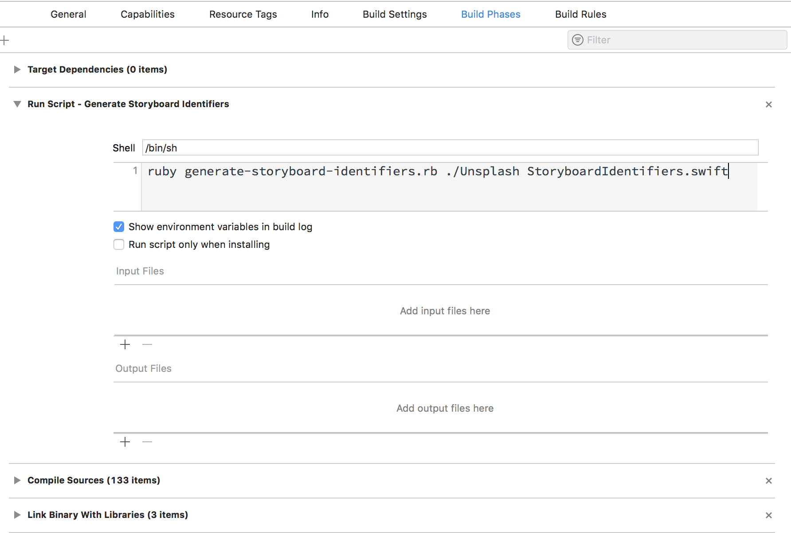

# Generate Storyboard Identifiers

This Ruby script parses `.storyboard` files to retrieve all the identifiers strings (view controllers, segues, table and collection view cells), and generates a `.swift` file with the values organized in `struct` objects.

The generated `.swift` file looks like this:

```swift
struct StoryboardIdentifier {
    static let template = "Template"
}

struct ViewControllerIdentifier {
    static let grid           = "Grid"
    static let gridNavigation = "GridNavigation"
    static let item           = "Item"
    static let list           = "List"
    static let listNavigation = "ListNavigation"
    static let tabBar         = "TabBar"
}

struct SegueIdentifier {
    static let addItem  = "AddItem"
    static let viewItem = "ViewItem"
}

struct CellIdentifier {
    static let gridItem = "GridItem"
    static let listItem = "ListItem"
}

extension UIStoryboard {
    class var template: UIStoryboard { return UIStoryboard.init(name: StoryboardIdentifier.template, bundle: nil) }
}
```

## How to use

Easy: `ruby generate-storyboard-identifiers.rb <path> <filename>`.

* `path`: the root folder from which the script reads the `.storyboard` files. It searches recursively.
* `filename`: optional, the name of the file where to store the identifiers. Its path is related to `path`.

## Automate in Xcode

In Xcode, select your target, then click _Build Phases_, add a _Run Script_ phase, move it up to the top, before _Compile Sources_, then type the command above.



## How to use the generated code

You can use the identifiers like this:

```swift
performSegue(withIdentifier: SegueIdentifier.viewItem, sender: sender)
```

and the storyboard extensions like this:

```swift
UIStoryboard.template.instantiateInitialViewController()
```

## License

MIT License

Copyright (c) 2018 Unsplash Inc.

Permission is hereby granted, free of charge, to any person obtaining a copy
of this software and associated documentation files (the "Software"), to deal
in the Software without restriction, including without limitation the rights
to use, copy, modify, merge, publish, distribute, sublicense, and/or sell
copies of the Software, and to permit persons to whom the Software is
furnished to do so, subject to the following conditions:

The above copyright notice and this permission notice shall be included in all
copies or substantial portions of the Software.

THE SOFTWARE IS PROVIDED "AS IS", WITHOUT WARRANTY OF ANY KIND, EXPRESS OR
IMPLIED, INCLUDING BUT NOT LIMITED TO THE WARRANTIES OF MERCHANTABILITY,
FITNESS FOR A PARTICULAR PURPOSE AND NONINFRINGEMENT. IN NO EVENT SHALL THE
AUTHORS OR COPYRIGHT HOLDERS BE LIABLE FOR ANY CLAIM, DAMAGES OR OTHER
LIABILITY, WHETHER IN AN ACTION OF CONTRACT, TORT OR OTHERWISE, ARISING FROM,
OUT OF OR IN CONNECTION WITH THE SOFTWARE OR THE USE OR OTHER DEALINGS IN THE
SOFTWARE.